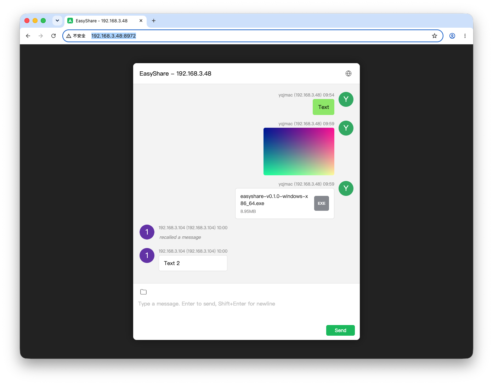

# EasyShare

[中文文档](README.zh-CN.md)

A single-file LAN sharing tool: start it on any device, and everyone else can share text, images, and files WeChat-style from their browser — no registration, no login, no client to install.



## Features & Highlights

- **Ready out of the box**: no installation, no accounts. Download, launch, share the address with family or coworkers, and start sharing
- **Familiar chat experience**: a WeChat-like interface for text, images, and files; click a thumbnail to view the full image
- **Works on any device**: no app needed — phones, tablets, and computers just open a URL in the browser
- **See who sent what**: the sender's device name is shown automatically
- **Large files welcome**: drag-and-drop upload, up to 1 GB per file, right-click to download
- **Recall mistakes**: right-click your own message to recall it; every screen updates in sync
- **Nothing gets lost**: chat history is stored locally and survives server restarts
- **Chinese & English UI**: follows your system language automatically, with a one-click manual switch
- **Your data stays yours**: everything lives on your own machine — nothing passes through third-party servers

## Getting Started

1. Download the package for your platform from [Releases](../../releases)
2. Launch the program (see per-platform instructions below)
3. The terminal prints the access address, for example:

   ```
   Server listening on http://192.168.3.48:8972
   Copy the URL above into your browser to get started.
   ```

4. Share this URL with other devices on your LAN (phones, computers — anything with a browser) and start sharing

Common actions in the chat window:

| Action | How |
|---|---|
| Send text | Type in the input box; Enter to send, Shift+Enter for a new line |
| Send images/files | Drag onto the input area, or click the folder icon at its top-left |
| View full image | Click the image thumbnail |
| Copy text | Right-click a text message → Copy |
| Download files | Right-click an image/file message → Download |
| Recall a message | Right-click your own message → Recall |
| Switch language | Click the globe icon at the top-right of the title bar |

## Launching on Each Platform

### macOS

Download `EasyShare-vX.Y.Z-mac.zip` and unzip to get `EasyShare.app`, then double-click:

- A Terminal window opens and prints the access address
- Your browser opens the chat page automatically
- If macOS says the developer "cannot be verified" on first launch: go to System Settings → Privacy & Security and click "Open Anyway", or run `xattr -d com.apple.quarantine EasyShare.app`

### Windows

Download `easyshare-vX.Y.Z-windows-x86_64.zip`, unzip, and run `easyshare.exe`:

- A terminal window prints the access address
- If SmartScreen warns on first launch: click "More info → Run anyway"
- If Windows Firewall asks whether to allow network access, choose Allow

### Linux

Download the tar.gz for your architecture (`amd64` for regular servers/PCs, `arm64` for ARM devices):

```bash
tar -xzf easyshare-vX.Y.Z-linux-amd64.tar.gz
./easyshare
```

The binary is statically linked with zero system dependencies and runs on any mainstream distribution as-is.

## Command-Line Options

```bash
easyshare --port 9000   # Listen on a custom port (default: 8972)
easyshare --version     # Show version
easyshare --help        # Show help
```

## Data & Migration

All data lives in an `easyshare-files/` directory next to the executable:

```
easyshare-files/
├── db/        # Message history
├── logs/      # Server logs
├── icons/     # User avatars
└── <uploaded images and files>
```

To back up or move to another machine: stop the server, then copy the executable together with this directory — messages, avatars, and files are all preserved.

## Building from Source

Requires the Rust toolchain and Docker (for cross-platform builds):

```bash
./release.sh    # Build every platform; artifacts land in release/vX.Y.Z/
```

Or build a single platform: `./build-mac.sh`, `./build-linux.sh [amd64|arm64]`, `./build-windows.sh`.
