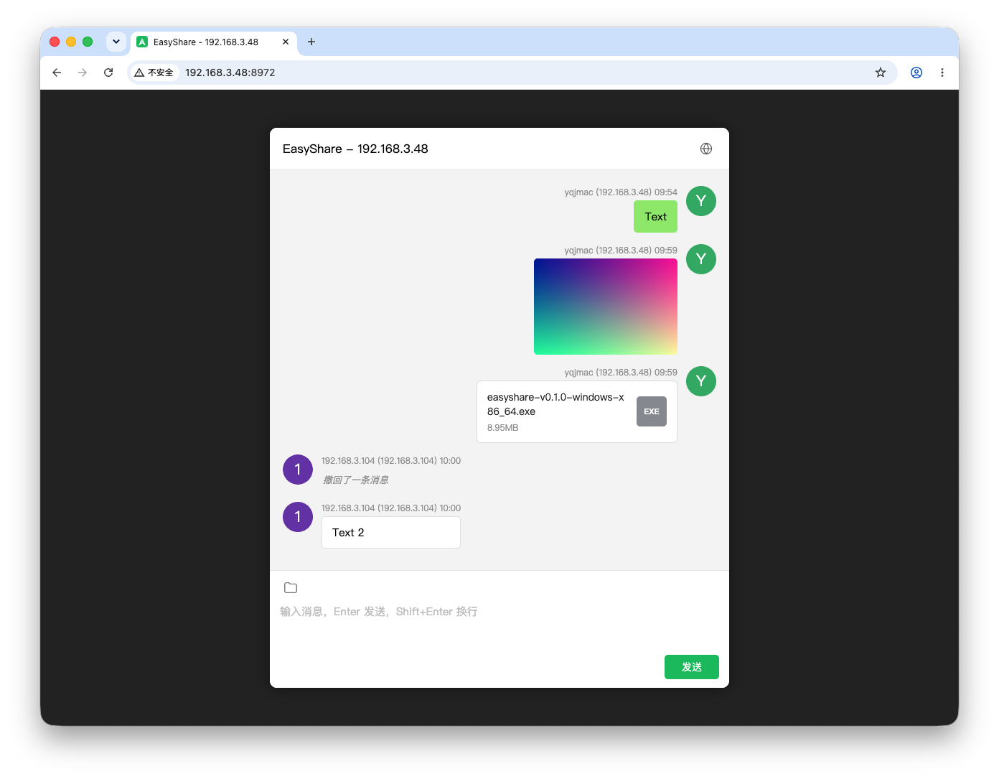

# EasyShare

一个单文件的局域网分享工具：在任意设备上启动它，其他设备用浏览器打开就能像微信一样互发文本、图片和文件——无需注册、无需登录、无需安装任何客户端。



## 功能与亮点

- **开箱即用**：不用安装、不用注册。下载、打开，把地址发给家人或同事，就能开始分享
- **和微信一样顺手**：熟悉的聊天式界面，文本、图片、文件随发随看，图片点开看大图
- **电脑手机通吃**：不需要装任何 App，手机、平板、电脑用浏览器打开网址即可
- **谁发的，一目了然**：自动显示发送者的设备名称，免去"这是谁发的"的困惑
- **大文件随便传**：拖拽即传，单文件最大支持 1GB，右键即可下载
- **发错了能撤回**：右键自己发的消息即可撤回，所有人的界面同步更新
- **消息不会丢**：聊天记录保存在本机，重启服务后历史记录依然都在
- **中英文界面**：自动按系统语言显示，也可以一键手动切换
- **数据完全自己掌控**：所有内容只存在你自己的机器上，不经过任何第三方服务器

## 使用方法

1. 从 [Releases](../../releases) 下载对应平台的包
2. 启动程序（见下方各平台说明）
3. 启动后终端会打印访问地址，例如：

   ```
   Server listening on http://192.168.3.48:8972
   Copy the URL above into your browser to get started.
   ```

4. 把这个网址发给局域网内的其他设备（手机、电脑都行），浏览器打开即可开始分享

聊天窗口中的常用操作：

| 操作 | 方法 |
|---|---|
| 发文本 | 输入框输入，Enter 发送，Shift+Enter 换行 |
| 发图片/文件 | 拖拽到输入区，或点击输入区左上角文件夹图标 |
| 看大图 | 点击图片缩略图 |
| 复制文本 | 右键文本消息 → 复制 |
| 下载文件 | 右键图片/文件消息 → 下载 |
| 撤回消息 | 右键自己发的消息 → 撤回 |
| 切换语言 | 点击标题栏右上角的地球图标 |

## 各平台启动方法

### macOS

下载 `EasyShare-vX.Y.Z-mac.zip`，解压得到 `EasyShare.app`，双击启动：

- 自动弹出终端窗口并打印访问地址
- 同时自动打开浏览器进入聊天页面
- 首次运行如提示"无法验证开发者"：在"系统设置 → 隐私与安全性"中点击"仍要打开"，或执行 `xattr -d com.apple.quarantine EasyShare.app`

### Windows

下载 `easyshare-vX.Y.Z-windows-x86_64.zip`，解压后运行 `easyshare.exe`：

- 终端窗口中会打印访问地址
- 首次运行如弹 SmartScreen 警告：点击"更多信息 → 仍要运行"
- 如 Windows 防火墙询问是否允许网络访问，请选择允许

### Linux

下载对应架构的 tar.gz 包（普通服务器/PC 选 `amd64`，ARM 设备选 `arm64`）：

```bash
tar -xzf easyshare-vX.Y.Z-linux-amd64.tar.gz
./easyshare
```

二进制为静态编译，不依赖任何系统库，所有主流发行版均可直接运行。

## 命令行参数

```bash
easyshare --port 9000   # 指定端口（默认 8972）
easyshare --version     # 查看版本
easyshare --help        # 查看帮助
```

## 数据与迁移

所有数据都保存在可执行文件旁的 `easyshare-files/` 目录中：

```
easyshare-files/
├── db/        # 消息记录
├── logs/      # 运行日志
├── icons/     # 用户头像
└── <上传的图片和文件>
```

备份或迁移到另一台机器：停掉服务，拷贝可执行文件和这个目录即可，消息记录、头像、文件全部保留。

## 从源码构建

需要 Rust 工具链和 Docker（跨平台构建用）：

```bash
./release.sh    # 一键构建全部平台，产物在 release/vX.Y.Z/
```

也可单独构建某个平台：`./build-mac.sh`、`./build-linux.sh [amd64|arm64]`、`./build-windows.sh`。
